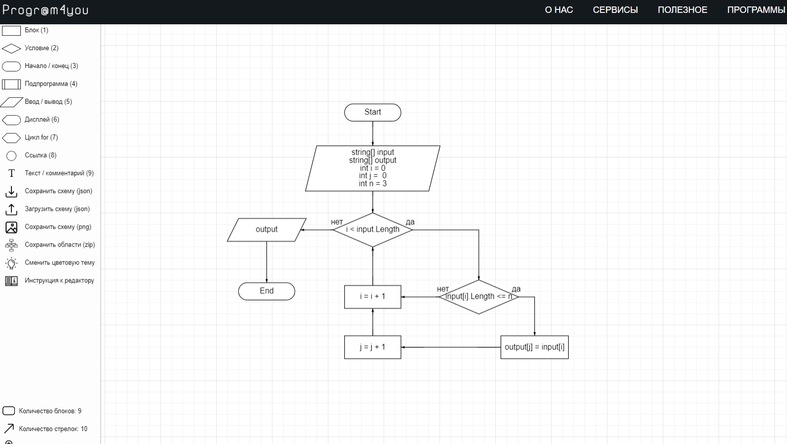

# Контрольная работа. 
## Условие задачи: 
Написать программу, которая из имеющегося массива строк формирует массив из строк, длина которых меньше либо равна 3 символа. Первоначальный массив можно ввести с клавиатуры, либо задать на старте выполнения алгоритма. При решении не рекомендуется пользоваться коллекциями, лучше обойтись исключительно массивами.
## Блок-схема

## Запуск программы:
Программу можно найти в папке "task" и при помощи команды dotnet run запустить ее через консоль(терминал).